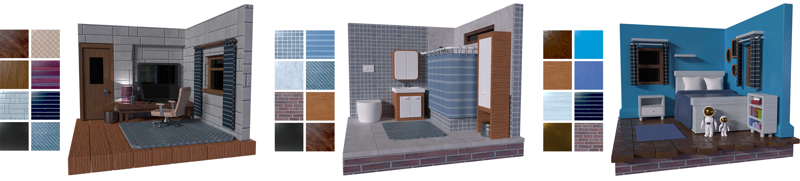
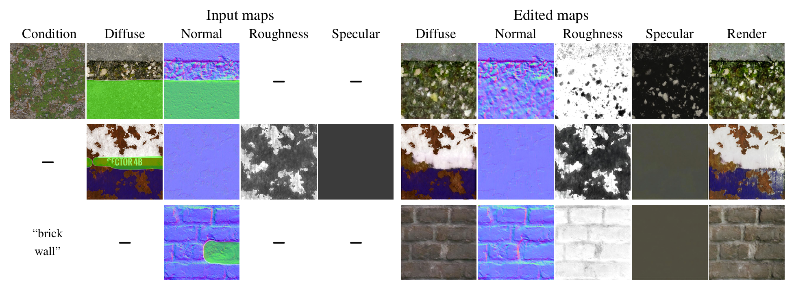
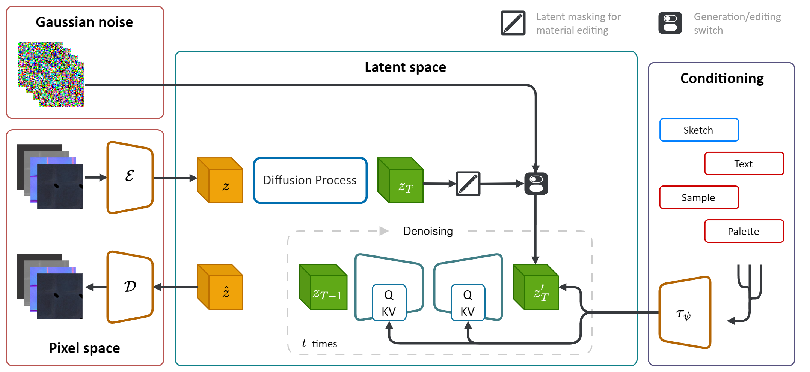
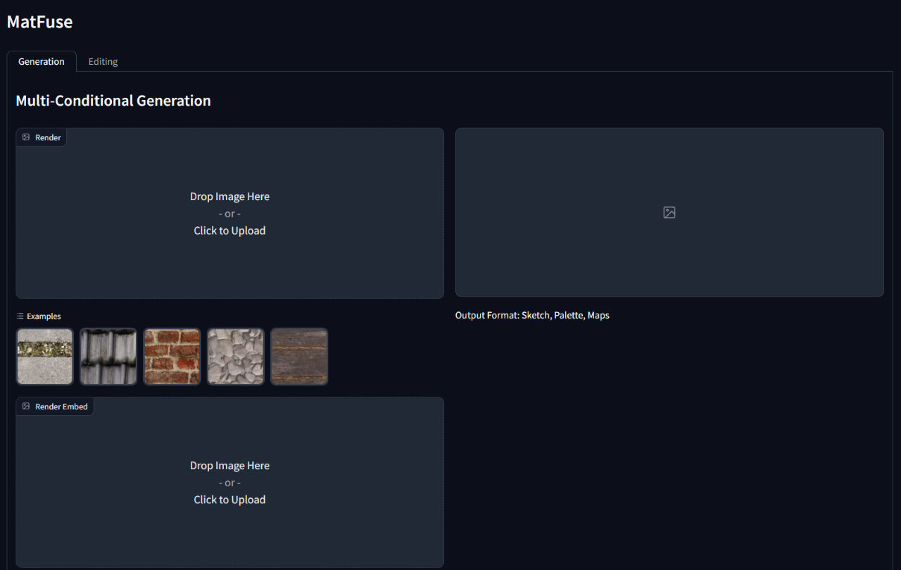
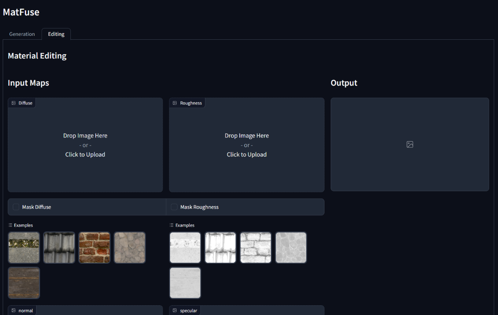

<div align="center">    
 
# MatFuse: Controllable Material Generation with Diffusion Models

[Giuseppe Vecchio](https://github.com/giuvecchio), [Renato Sortino](https://rensortino.github.io), [Simone Palazzo](https://github.com/simopal6) and [Concetto Spampinato](https://github.com/cspampin)

[](https://arxiv.org/abs/2308.11408)
[](https://gvecchio.com/matfuse/)
[](https://cvpr.thecvf.com/Conferences/2024/AcceptedPapers#:~:text=MatFuse:%20Controllable%20Material%20Generation%20with%20Diffusion%20Models)
[](https://huggingface.co/gvecchio/MatFuse)

</div>




# 🔍 Overview

The official PyTorch implementation for paper __"MatFuse: Controllable Material Generation with Diffusion Models"__.

MatFuse is a novel approach that simplifies the creation of SVBRDF (Spatially-Varying Bidirectional Reflectance Distribution Function) maps. 

It leverages the generative power of diffusion models (DM) to streamline the material synthesis process. By integrating multiple sources of conditioning, including color palettes, sketches, text, and pictures, it provides fine-grained control and flexibility in material generation. 

Additionally, MatFuse enabled editing or refining the synthesized materials after their initial generation. It supports a map-level editing by masking specific areas of specific maps or the entire material.

<div align="center">
  
</div>

#### See more exaples from MatFuse at the [project page](https://gvecchio.com/matfuse).

### 📄 Paper abstract

Creating high-quality materials in computer graphics is a challenging and time-consuming task, which requires great expertise. To simply this process, we introduce **MatFuse**, a unified approach that harnesses the generative power of diffusion models to simplify the creation of SVBRDF maps. Our pipeline integrates multiple sources of conditioning, including color palettes, sketches, text, and pictures, for a fine-grained control and flexibility in material synthesis. This design enables the combination of diverse information sources (e.g., sketch + text), enhancing creative possibilities in line with the principle of compositionality. Additionally, we propose a multi-encoder compression model with a two-fold purpose: it improves reconstruction performance by learning a separate latent representation for each map and enables a map-level material editing capabilities. We demonstrate the effectiveness of MatFuse under multiple conditioning settings and explore the potential of material editing. We also quantitatively assess the quality of the generated materials in terms of CLIP-IQA and FID scores.

<div align="center">
  
</div>

#### Read the full MatFuse paper on [arXiv](https://arxiv.org/abs/2308.11408).


### 📂 Repository details

This repo relies on the original latent diffusion implementation (https://github.com/CompVis/stable-diffusion) which has been modified to include the features described in the **MatFuse** paper. If you're familiar with the original stable diffusion codebase you should have no problems running this one.

The most relevant changes are:
- a new multi-encoder vq-vae architecture which processes each material map (diffuse, normal, roughness and specular) independently, learning a disentangled latent representation. 
- a new a _VQMaterialLoss_ which combines the original _VQLPIPSWithDiscriminator_ with a rendering loss.
- multi-condition fusion mechanism.

MatFuse is trained on a combination of the dataset by Deschaintre et al. (2018) and materials from the [PolyHeaven](https://polyhaven.com/) library. We do not plan to release such dataset as it can be easily collected. Anyway, if you plan to train your own MatFuse, we strongly recomend using the recently released dataset **[MatSynth](https://gvecchio.com/matsynth)** which contains a wider variety of high-resolution materials and annotations.

# 💿 Installation

#### 1. Clone the repo

```shell
git clone https://github.com/giuvecchio/matfuse-sd.git
cd matfuse-sd
```

#### 2. Setting up the virtualenv

This is assuming you have navigated to the `matfuse-sd` root after cloning it.

**NOTE:** This is tested under `python3.10`. For other python versions, you might encounter version conflicts.

**PyTorch 1.13.1**

```shell
# create environment (can use venv instead of conda)
conda create -n sdiff python==3.10.13
conda activate sdiff
# install pytorch with cuda
conda install pytorch==1.13.1 torchvision==0.14.1 torchaudio==0.13.1 pytorch-cuda=11.7 -c pytorch -c nvidia
# install required packages
pip install -r requirements.txt
```

# 💪 Training

Training of MatFuse requires two steps: 
1. Training of the autoencoder (VQ-VAE)
2. Training of the diffusion model (LDM)

Both is accessed through the `main.py` script in the `src` folder and relies on the use of config files to setup the models, datasets and losses. \
Config files are located under `src/configs/`, and are split in `autoencoder` and `diffusion` subfolders. \
Use the right config file depending on the part of the model you want to train.

The general command to launch a training is:

```shell
python src/main.py --base src/configs/<model>/<config.yaml> --train --gpus <indices,>
```

## Data preparation
We provide a dataset class for the training of MatFuse. This dataset expects the data folder to be structured as shown below.

```
./data/MatFuse/{split}/
├── bricks_045
│   ├── metadata.json
│   ├── diffuse.png
│   ├── normal.png
│   ├── roughness.png
│   ├── specular.png
│   ├── sketch.png
│   ├── renders
│       ├── render_00.png
│       ├── render_01.png
│       ├── ...
├── ...
```
Data shouldbe split between `train` and `test` sets. Each material folder contains the required SVBRDF maps (diffuse, normal, roughness, specular), the sketch and a `metadata.json` file with the text caption and the color palette.

⚠️ **Note:** To run a training, update the `data_root` property in the config file to point to the folder where you have your dataset stored.

### Processing the data
We provide a script to extract the color palette from the renders under the `src/scripts/data` folder. To run it run:
```shell
python src/scripts/data/extract_palette.py --data <path/to/dataset>
```

## Training the autoencoder

Configs for training an autoencoder are provided at `src/configs/autoencoder`. \
MatFuse uses a VQ-regularized model. For more info see the [taming-transformers](https://github.com/CompVis/taming-transformers) repository.

Training can be started by running

```shell
python src/main.py --base src/configs/autoencoder/multi-vq_f8.yaml --train --gpus 0,
```

## Training the LDM

In `src/configs/diffusion/` we provide configs for training the MatFuse LDMs. Training can be started by running

```shell
python src/main.py --base src/configs/diffusion/matfuse-ldm-vq_f8.yaml --train --gpus 0,
```

### Resuming a training

To resume a training append the arguments `--resume <log/folder>` to the training command.

### Notes:

If you're training on Windows remember to set the distributed backend to `gloo`. **Others are not supported!**

```shell
$env:PL_TORCH_DISTRIBUTED_BACKEND='gloo'
```

To limit the number of visible GPUs use: 

```shell
CUDA_VISIBLE_DEVICES=<GPU_ID> python src/main.py ...
```

The experiments are automatically logged using [Weights and Biases](https://wandb.ai/site).
To specify your own project space and project name set the following environment variables:

```shell
WANDB_PROJECT='{YOUR_PROJECT_NAME}'
WANDB_ENTITY='{YOUR_PROJECT_SPACE_NAME}'
```

# 🧪 Inference

To run inference on a trained model, run the `gradio_app.py` script specifying the path to the model checkpoint and the configuration. \
This will open a web interface to perform conditional generation and material editing.

### ⚠️ Notes
- For inference, at least 12GB of GPU VRAM are necessary.
- Weights are available at [huggingface.co/gvecchio/MatFuse](https://huggingface.co/gvecchio/MatFuse). We provide both ema only weights (pruned) and full weights. The gradio app expects the full weights to be provided.

```shell
python src/gradio_app.py --ckpt <path/to/checkpoint.ckpt> --config src/configs/diffusion/<config.yaml>
```

<div align="center">
   
</div>

####

# 📜 Citation

```bibtex
@inproceedings{vecchio2024matfuse,
  author    = {Vecchio, Giuseppe and Sortino, Renato and Palazzo, Simone and Spampinato, Concetto},
  title     = {MatFuse: Controllable Material Generation with Diffusion Models},
  booktitle = {Proceedings of the IEEE/CVF Conference on Computer Vision and Pattern Recognition (CVPR)},
  month     = {June},
  year      = {2024},
  pages     = {4429-4438}
}
```
